## Table of Contents

## Verification with System Verilog

General Steps:

- Generate stimulus
- Apply stimulus to DUT
- Capture the response
- Check for the correctness
- measure progress against overall verification goals

Will be discussed in more detail with the Universal Verification Methodology (UVM).

## Some basic data types

- wire / reg
  - structural data types called nets, which model hardware connections between circuit components, replaced with logic
- logic
  - improved version of reg and wire, driven by continuous assignments, gates, and modules -> basically any sort of signal
- integer
  - declares one or more variables of type integer. Can hold values ranging from -2^31 to 2^31 - 1.
- real
  - floating point values stored as 64-bit double precision floating point values
- time
  - is a 64-bit quantity that can be used in conjunction with $time system task to hold simulation time
- events
  an event is to handle synchronization objects that can be passed to routines to check whether interrupt is triggered
- user-definied types
  - define a new type usign `typedef`, as in C

Format: [precision]`[basetype][value]
Example, Binary: 8'b1011011

### Logical Data Types:

- May be used as concurrent assignments or sequential assignments. Can be used as input, output, and local signals.
  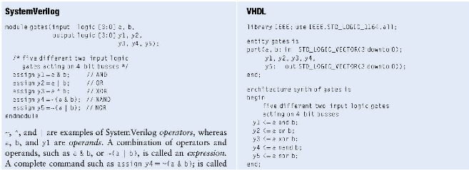

### Operators

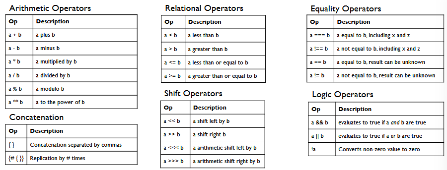

## Time

Timescale directive specifies the time units and precision for simulations.

## Math Functions

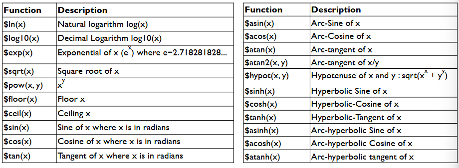

## Enumerations

An enumerated type defines a set of named values .Enumerated type declaration contains a list of constant names. You can also assign default values to names like

`enum { red=10, green=20, blue=30, yellow=40 } Colors;`

## Arrays

An array is a collection of variables, all of the same type, accessible by one or more indices. Single dimensional array like so: `int arr [5:0]; // Verbose declaration`. Multidimensional arrays are defined like so: `int arr [2][2][2]; // 3D array with 2*2*2 = 8 elements`.

Array assignment looks like
`arr = '{'{0,1,2,3},'{4,5,6,7},'{8,9,10,11}};`

### Packed vs. Unpacked

Packed arrays are used to refer to dimensions declared before the data indentifier name. A packed array is guarunteed to be represented as a contiguous set of bits in memory. Unpacked arrays are used to refer to dimension declared after the data indentified name. A synthesizer may interpret them as independent sets of bits that are not necessarily contigous.

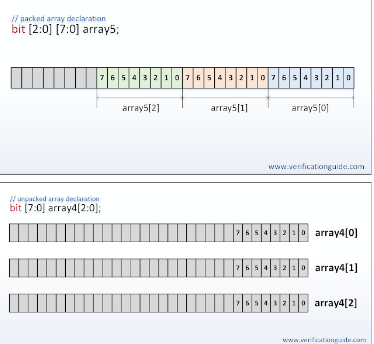

### Dynamic Arrays

A dynamic array is a one dimension of an unpacked array whose size can be set or changed at run-time. Dynamic array is declared using an empty word subscript `[]`. `new[]` allocates the storage. `size()` returns the current size of a dynamic array. `delete()` empties the array, resulting in a zero-sized array.

### Associative Arrays

An associative array implements a lookup table of the elements of the declared type (like a library in python). In associative array index expression is not restricted to integral expressions, but can be of any type. The data type to be used as an index serves as the lookup key and imposes an ordering. They only allocate the storage when used and are not synthesizable.

Some methods of associative arrays:
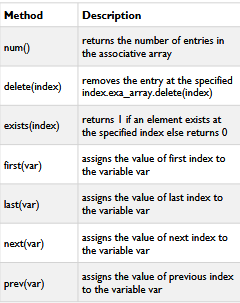

### Array Functions

Some of these functions are synthesizable, others are not, for various reasons.

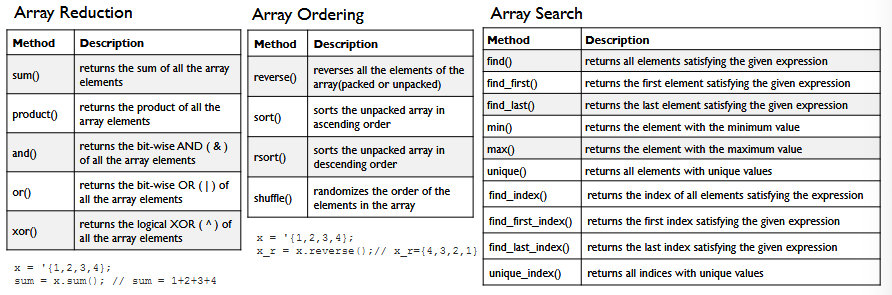

## Inferring Shift Register

- To infer shift registers, synthesis tools detect a group of shift registers of teh same length and convert them to a shift register IP core.
- Use array assignment statemetn to shift register values.
  - Use the same clock and clock enable
  - Do not have any secondary signals
  - Have equally spaced taps that are at least three registers apart

```systemverilog
module shift_8x64 (
input logic clk,
input logic shift,
input logic [7:0] sr_in
output logic [7:0] sr_out
);
reg [63:0] [7:0] sr;
always @ (posedge clk)
begin
if (shift == 1'b1)
begin
sr[63:1] <= sr[62:0];
sr[0] <= sr_in;
end
end
assign sr_out = sr[63];
endmodule
```

Should yield this:
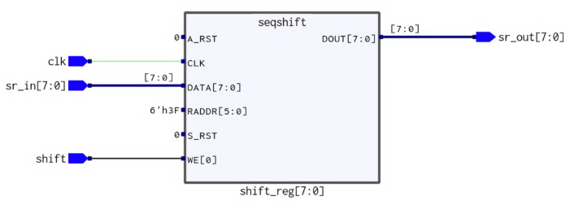

## Queues

A queue is a variable-size, ordered collection of homogenous elements. Like a dynamic array, queues can grow and shrink. Queue supports adding/removing elements. They are declared using the same syntax as unpacked arraysm but using $ as the array size. In queue, `0` is the first entry and $ is the last entry.

```systemverilog
int queue_0[$:255] // bounded queue of 255 elements
int queue_1[$]; // unbounded queue of int
queue_1 = {0,1,2,3};
```

### Unbounded vs. Bounded

- Bounded queues are ones where the number of entries are specified. Unbounded queues have unlimited entries.
  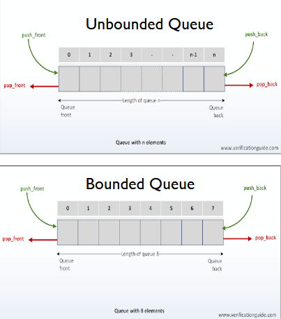

## Blocking vs. Nonblocking

A _blocking assignment_ executes in series order. Blocking assignment blocks the execution of the next statement until the completion of the current assignment. Use `a = b;`

A _non-blocking assignment_ executes statements in paralle. In the non-blocking assignment, all the assignments will occur at the same time (at the end of simulation cycle). Use `a <= b;`

## Ifs

### Unique If

Unique if evaluates all the conditions in parallel. The simulator will issue a run time error/warning if zero ore more than one condition is true:

```systemverilog
// RT Warning: More than one conditions match in 'unique if' statement.
unique if ( a < b ) $display("a is less than b");
else if ( a < c ) $display("a is less than c");
else $display("a is greater than b and c");
```

Instead of having a long 'priority queue', the conditionals are evaluated parallel under the assumptions that conditions are independent, and that if condition 'a' is true, then condition 'b', 'c' 'd', ..., etc. are all false.

### Priority If

Priority ifs evaluate all the conditions in sequential order. Simulator will issue a runtime error/warning if no condition is true or no corresponding else.

```systemverilog
// RT Warning: No condition matches in 'priority if' statement.
priority if ( a < 20 ) $display("a is less than b");
else if ( a < 40 ) $display("a is less than c");
```

## Always - Combinational Logic

`always` blocks are combinational logic. You have to include input signals in the sensitivity list (tells when to update process). You can also use the wildcard (\*) to include all combinational signals.

```systemverilog
// combinational full-adder
always @ (a or b or cin) begin
{cout, sum} = a + b + cin;
end
```

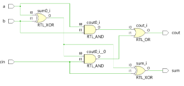

### `always_comb` - combinational processes

SystemVerilog introduces `always_comb`, which does not require a sensitivity list. Use `always_comb` blocks with blocking assignments (`=`). Every variables should have a default value to avoid introduction of latches. Do't assign to same variable from more than always_comb block (introduces race conditions or synthesizes incorrectly).

## `always_ff` - clocked processes

An always block may also be used to implement sequential logic which has memory elements like flip flops that can hold values. SystemVerilog introduces `always_ff` for clocked signals. Use `always_ff@(posedge clk) only with non-blocking assignment operator (<=). Use non-blocking assignments for sequential logic, and block assignments for combinational logic.

## Block RAM

A _Block RAM (BRAM)_ is a dedicated memory resource built into FPGAs that provides efficient on-chip storage. Unlike distributed RAM (which uses LUTs), block RAM uses specialized memory blocks that are optimized for high-density storage with configurable data widths and depths.

### Key Characteristics:

- _Synchronous Operation_: Block RAMs are clocked memory elements, requiring at least one clock cycle for read operations
- _Dual-Port Capability_: Most FPGAs support true dual-port BRAMs, allowing simultaneous read/write operations from two independent ports
- _Pipeline Delay_: Typically has one cycle of latency between providing an address and receiving data (registered output)
- _Efficient Resource Usage_: More area-efficient than using LUTs for large memories
- _Configurable Width/Depth_: Can be configured for various data width and address depth combinations (e.g., 1Kx16, 2Kx8, etc.)

Block RAMS use dedicated memory blocks, synchronus reads (1-cycle latency), which are better for larger memories. Distributed memories are essentials LUTs which are used for 0 cycle latency or small memories.

### Example of Block RAM

In a typical block RAM implementation, we have two processes:

1. A combinational read process that outputs data from a registered address
2. A sequential process that registers the read address and handles writes

This design requires one input cycle delay between address and data:

```systemverilog
module bram
#(parameter BRAM_ADDR_WIDTH = 10,
parameter BRAM_DATA_WIDTH = 8)
(input logic clock,
input logic [BRAM_ADDR_WIDTH-1:0] rd_addr,
input logic [BRAM_ADDR_WIDTH-1:0] wr_addr,
input logic wr_en,
input logic [BRAM_DATA_WIDTH-1:0] din,
output logic [BRAM_DATA_WIDTH-1:0] dout);
logic [2**BRAM_ADDR_WIDTH-1:0][BRAM_DATA_WIDTH-1:0] mem;
logic [BRAM_ADDR_WIDTH-1:0] read_addr;
always_comb begin
dout = mem[read_addr];
end
always_ff @(posedge clock) begin
read_addr <= rd_addr;
if (wr_en) mem[wr_addr] <= din;
end
endmodule
```

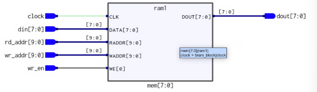

## Generate

A generate block allows to multiply module instances or perform conditional instantiation of any module. It provides the ability for the desigin to be built on Verilog params.

There are three kinds of generate statements: `generate-for`, `generate-if`, `generate-case`.

### Distributed Block RAM

Suppose we have 32 bit memory and we only want to write to 2 bytes. This would be better suited for Distributed Block RAM (have 8 bit block RAMs that are stacked).

This can be done in 2 ways: unpacked array or generate-for:

```systemverilog
// Unpacked Array
module bram_block
#(parameter BRAM_ADDR_WIDTH = 10,
parameter BRAM_DATA_WIDTH = 32)
(input logic clock,
input logic [BRAM_ADDR_WIDTH-1:0] rd_addr,
input logic [BRAM_ADDR_WIDTH-1:0] wr_addr,
input logic [BRAM_DATA_WIDTH/8-1:0] wr_en,
input logic [BRAM_DATA_WIDTH-1:0] din,
output logic [BRAM_DATA_WIDTH-1:0] dout);
bram #(
.BRAM_ADDR_WIDTH(BRAM_ADDR_WIDTH),
.BRAM_DATA_WIDTH(8))
brams [BRAM_DATA_WIDTH/8-1:0] (
.clock(clock),
.rd_addr(rd_addr),
.wr_addr(wr_addr),
.wr_en(wr_en),
.dout(dout),
.din(din)
);
```

```systemverilog
// Generate-For
module bram_block
#(parameter BRAM_ADDR_WIDTH = 10,
parameter BRAM_DATA_WIDTH = 32)
(input logic clock,
input logic [BRAM_ADDR_WIDTH-1:0] rd_addr,
input logic [BRAM_ADDR_WIDTH-1:0] wr_addr,
input logic [BRAM_DATA_WIDTH/8-1:0] wr_en,
input logic [BRAM_DATA_WIDTH-1:0] din,
output logic [BRAM_DATA_WIDTH-1:0] dout);
genvar i;
generate
for (i=0; i < BRAM_DATA_WIDTH/8; i++)
begin
bram #(
.BRAM_ADDR_WIDTH(BRAM_ADDR_WIDTH),
.BRAM_DATA_WIDTH(8)
) bram_inst (
.clock(clock),
.rd_addr(rd_addr),
.wr_addr(wr_addr),
.wr_en(wr_en[i]),
.dout(dout[(i*8)+7 -: 8]),
.din(din[(i*8)+7 -: 8])
);
end
endgenerate
endmodule
```

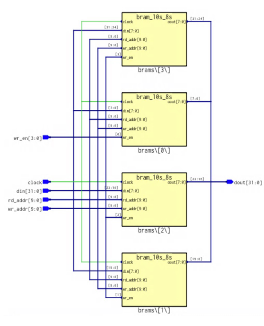
