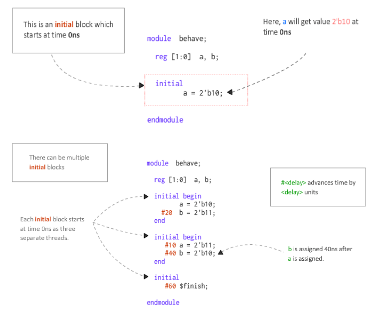
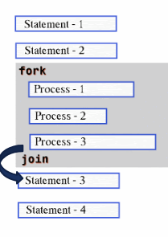
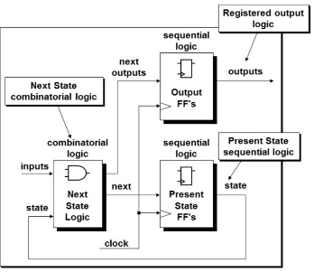
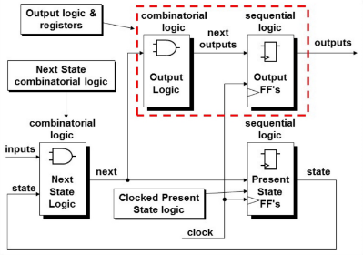
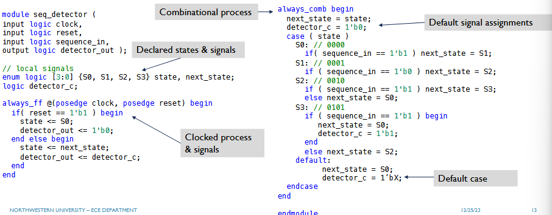

## Table of Contents

## Notes on BRAM/DBRAM Usage

Logic is platform agnositc... either register the read address or register the DOUT -> looking for a 1 cycle delay on the read path, which allows the synthesis tool to understand it is a BRAM (instead of using LUTs as a BRAM, which doesn't take advantage of hardware capabilities).

`for-generate` example for DBRAM and `-'`, from that position down by \_\_\_\_. SystemVerilog allows you too.

## Processes Review

An always block may be used to implement sequential logic which has memory elements like flip flops that can hold values. SystemVerilog introduces 2 new process types:

- `always`: default process for combinational logic

```verilog
always @ (a or b or cin)
begin
  {cout, sum} = a + b + cin;
end
```

- `always_comb`: does not require a sensitivty list

```verilog
always_comb
begin
  out = 2’d0; // default value
  if (in1 == 1)
    out = 2’d1;
  else if (in2 == 1)
    out = 2’d2;
  end
end
```

- `always_ff`: for clocked signals

```verilog
always_ff @(posedge clk or posedge rst)
begin
  if (rst == 1’b1) q <= ‘0;
  else q <= d1;
end
```

### Initial Statements

Initial blocks are used for initializing variables and arrays. You can have any number of initial blocks. These blocks are _not synthesizable_. They are mostly used for simulation purposes.



### Functions

Properties of functions:

- Inlined expressions evaluated at compile time
- Instantaneous combinational logic
- May not contain time-controlled statements
- Can return only one value

```verilog
function int sum(const ref int x,y);
  x = x + y;
  return x;
endfunction
```

Static functions share the same storage space for all function calls. In addition, automatic functions limit the scope of the variables inside them. This just means that every instance of the function is unique.

```verilog
// re-entrant (automatic) function
function automatic
  int factorial (input [31:0] x);
begin
  if (x >= 2) factorial = factorial(x - 1) * x;
  else factorial = 1;
endfunction: factorial
```

In SystemVerilog, arguements can be passed by value, by reference, as constant, and with a default value.

### Tasks

Static tasks share teh same storage space for all task calls. Automatic tasks allocate unique, stacked storage for each task call and are 're-entrant' (e.g recursive). Tasks can calculate multiple results over multiple cycles. Tasks may contain parameters, input/output/in-out arguements, registers, events, and 0 or more behavioral statements.

## Fork-Join

Fork-Join starts all processes inside in parallel and then waits for all processes to complete. Join is a blocking process.

Example:


```verilog
0 Starting processes
0 Process-1 Started
0 Process-2 Started
0 Process-3 Started
5 Process-2 Finished
10 Process-1 Finished
20 Process-3 Finished
20 All processes completed
```

### Fork-Join-Any

Fork-Join-Any starts all processes inside at the same time in parallel, and if _any_ process completes, then program moves forward (doesn't wait for remaining process finish). `join-any` is a blocking process.

### Fork-Join-None

Launches the processes but does not wait for all processes to complete. `join_none` is a non-blocking process.

## Finite State Machines

### Single-Process FSM

In a single process FSM, the case statement and all signals are registered under a clocked process (always_ff) and is considered a more safe design methodology. If hardware is often subject to rapid change in temperature, altitude, or requries high reliability, then this is used. However, you are losing some performance, since you could've possibly did some extra logic mid-clock, and you add extra cycles.


### Two-Process FSM

In a two-process FSM, the combinational and register logic are seperated into 2 processes (`always_comb` and `always_ff`). Combinational logic gets fed into clocked process, clocked process registers them to steady-state signal, and gets fed into combinational block.



## Example: Sequence Detector


Note that in combinational logic, all assignments are blocking.
