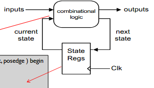
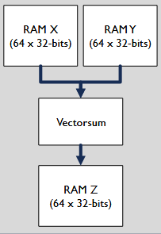
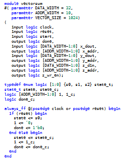
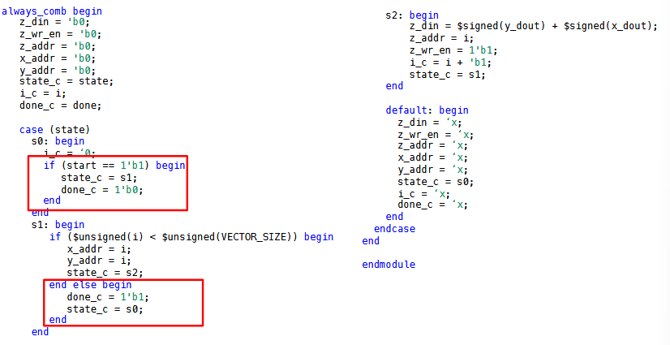
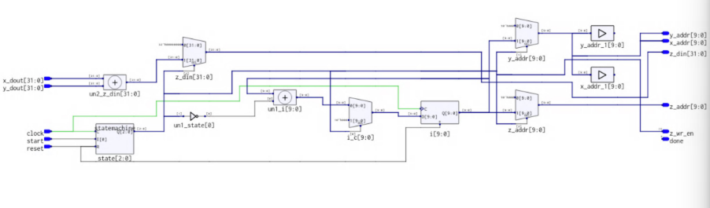
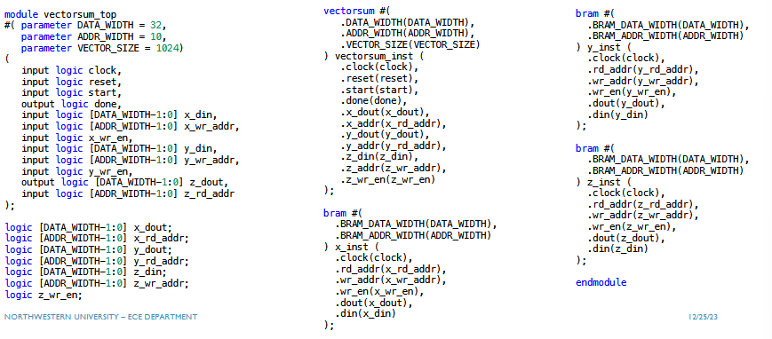
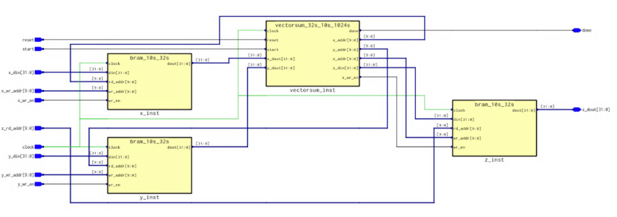
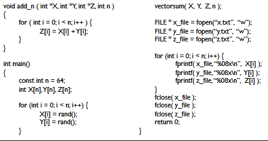
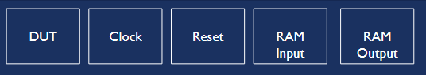

## Table of Contents

## Hierarchical Design Synchronization

- Sperates the FSM into combinational and clocked processes
- Use `start` and `done` signals for synchronizations
- Parent module initials the start and then waits on done



## Design Example: Vector Sum

Without context, we don't know to what addresses X, Y, and Z point

- Local Memory Block (Block RAMs / FIFOs)
- Constant Memory (ROMs)
- External Memory (DDR3)
- Peripheral (Audio / Video)
- Bus (SoC)

```verilog
void add_n ( int *X, int *Y, int *Z, int n )
{
   for ( int i = 0; i < n; i++ )
   {
     Z[i] = X[i] + Y[i];
   }
}
```

Most architecture work is spent passing data between funcitions, optimizing memory addressing, accessing I/O data.

Vectorsum in context:

- want to read X and Y from RAMS
- COmpute vector addition of n-elements
- write the output array Z to RAM

In software, this is done sequentially, but we can assume that we pull X and Y at teh same time from RAM.



## Implementation




Note that `'b0` automatically extends the `0`s to the initialized bit width. Integers are 32-bits, so it makes sense to limit the counter to whatever the address width actually is. In this case, we don't care about negative numbers and don't need full 32 bit capacity of integer.

Block RAM requires one extra cycle... so if we put the address in state 1, then we need to read from it in state 2. The architecture is as follows:



### Vectorsum Top

This is the wrapper.




## Design Validations

- Capture the input and output data of a software model
- Use the data to simulate and test your RTL model

C code:


## Testbench Design

- Simulation processes
  - Design under test (DUT) - the design architecture
  - Clock - instantiates the various clock signals for the different components
  - Reset - an asynchronus reset for the signals in the design
  - RAM Input: reads the input data from file and writes to input memory
  - RAM output - reads the output data from memory and writes to file. Also compares output data to software data.



We require two seperate processes since the BRAMS for `X` and `Y` are independent.

## Streaming Architectures

FIFO inherently handles all the handshaking, so that if consumer is not pulling from x-y because its waiting on z, then the X and y buffers get filled, and the producers no longer can write to them (full signal goes high), and the producers get stalled. Can read immediately, instead of waitign for BRAM and their latencies.

## Image Processing Example: Greyscale Conversion

We take an existing RGB and convert it to greyscale -> usually goes from 24 bits to 8 bits per pixel (0-255). Greyscale is the average of RGB pixels, and we can use a streaming architecture to iterate over image pixels sequentially. The averaging requires 3 8 bit numbers added together, which is max 768, and lower number of bits required is 10 bits. Division by any constant is a combinational logic block (done by synthesis block).

Vectorsum operation on greyscale conversion is the similar, except that greyscale conversion requires reading from just one BRAM.

Motion Detection: Take base image, subtract new image from old image and differnce between two pixels is greater an some threshold, then consider as 'motion', and generates a foreground mask.
