## Table of Contents

## Motivation

Traditionally, transistors are ideal switches (voltage controlled resistors). The source and drain are interchangeable.

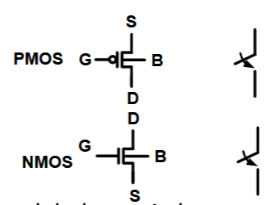

Every transistor have 4 terminals - the gate, source, drain, and body. In some technologies (smaller nm), the body doesn't exist. In NMOS, lower voltage terminal is source, and for PMOS, higher is source. However this is very idealized, and a switch model does not account for some important specs, such as speed, power, and thermal effects.

Switching of gate voltage will trigger a charging process at the output. This is a voltage controlled resistor model (VCR) like so:
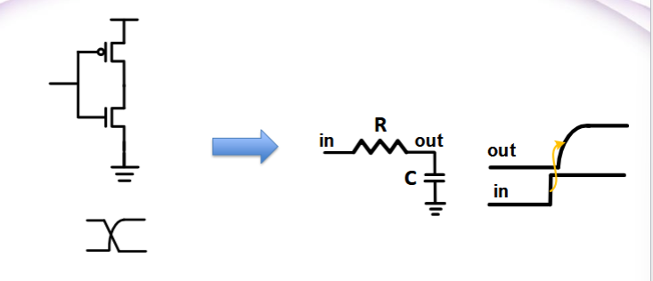

The capacitance is a 'parasitic' that is a sum of contributions from other transistors, environment, material properties. In a charging process, at a single time constant ($\tau = RC$), the output voltage is 63% of input. We need to establish stronger equations for some critical parametrs, such as

- Ids vs Vgs and Vds
- Capacitances of the transistors, such as Cgs, Cgd
- The current and capacitance determines the speed of the operation (clock frequency of the design)

Here's what the subscript convention is: Ids is the current from drain to source; Vgs is voltage between gate and source, and so on.

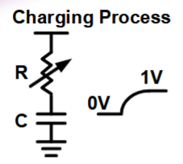

## Silicon Doping

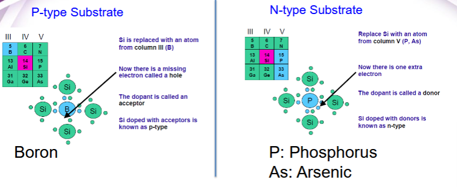

Doping lightly replaces Si atoms with column III elements (like Boron). Since this replacement reduces 1 electron, this opens up an electron vacancy (known as a 'hole'). Effectively, this acts as a mobile positive charge carrier. Thus, the P-type substrate has a slight 'positve' charge.

N-type substrates are doped with column V elements. This adds an 'extra' electron, which is acts as a mobile negative charge carrier.

## Transistor Operation Modes (NMOS Illustration)

- P-type substrate
- Source and Gain are highly doped - N-type

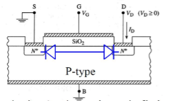

There are three operation modes are related to the state of the silcon of transistor, which are depending on relative gate and source voltages:

1. Accumulation
   In accumulation, we assume the gate is negative (less than 0 V relative to p-substrate). This accumulates positive charge toward the gate of the channel. Thus there is a very strong positive charge under the gate, and a strong negative charge at the N-type regions. Thus, this is a P-N type diode. In this mode, there will be no current flow (transistor is 'off')!
   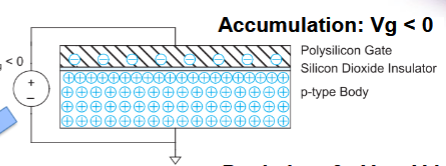

2. Depletion
   In depletion, you apply a little bit of positive charge (less than some threshold) to the gate, which pushes away the positive charge regions in the substrate. This forms a 'depletion' region. This yields no charge carriers, so no current can flow.
   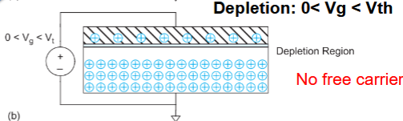

3. Inversion

- In inversion, you apply V_g > V_th, so there is an attraction of the electrons present in the substrate towards the gate. At the same time, the 'positive charge' pushed away towards the body.
  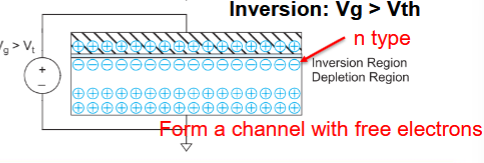

This process is much more complicated, but from a layout design perspective, this abstraction is probably ok.

## Terminal Voltages

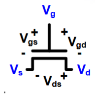

- Mode of operation depends on V_g', V_g', and Vs
  - Vgs = Vg - Vs
  - Vgd = Vg - Vd
  - Vds - Vd - Vs = Vgs - Vgd
- Source and drain symmetric diffusion terminals.

### Regimes of Operation

- Cuttoff (Depletion or Accumulation)
- Linear (Inversion)
- Saturation (Inversion): just like in any dynamical system, the inversion behavior has 2 regimes: linear and saturation. The linear region represents a proportional increase in current through transistor due to an increase in source voltage. The saturation region occurs when the input voltage is significantly high, in which the current does not increase.

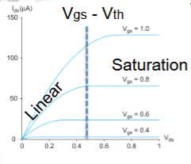

The condition to be in the linear region is as follows: $V*{ds} \lessthan V*{gs}-V\_{th}. This is because the channel may no longer be even, and the electron current 'saturates' (phenomenon known as pinch off).
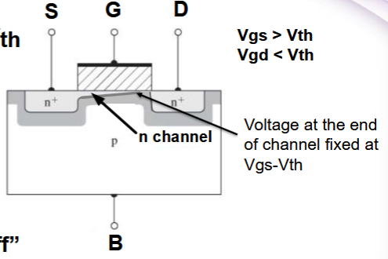

## Bulk Charge Model for Ids

- MOS structure looks like a parallel plate capacitor while operating under inversion:
  $Q_channel = C \cdot V$ yields $C = C_g = \frac{\epsilon_{ox}WL}{t_{ox}}$

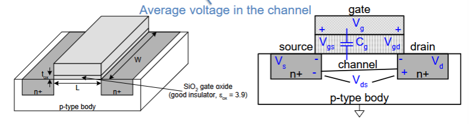
