## Table of Contents

## Creating a Project

Cadence uses a file hierarchy systems to make project management simple. There are 3 levels:

- Libraries: Project File, contains any devices you create that need to be linked to each otehr
- Cells: Directory that holds all designs related to a specific component.
- Views: Different types of designs you have for each cell.

In this tutorial, I create schematic, hspice, symbol, and layout views for a cell.

## Building a Schematic

Using a create -> instance tool, select the NMOS_VTG from the NCSU_Devices_Library. VTG stands for generic transition voltage. PMOS: Width: 600 nm, Length 50 nm, NMOS: Width: 400 nm, Length: 50 nm. Choose symbol view and click in schematic window to place.

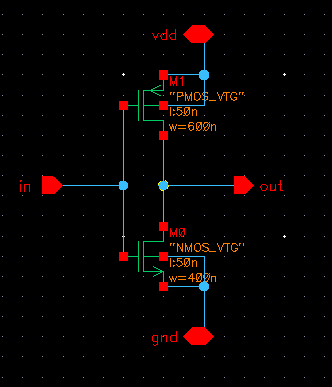
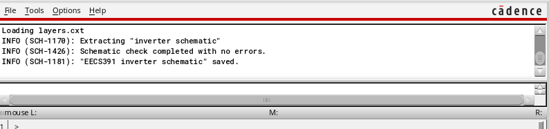
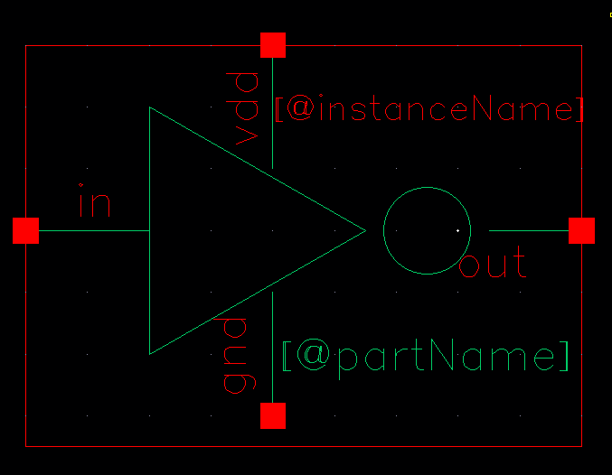
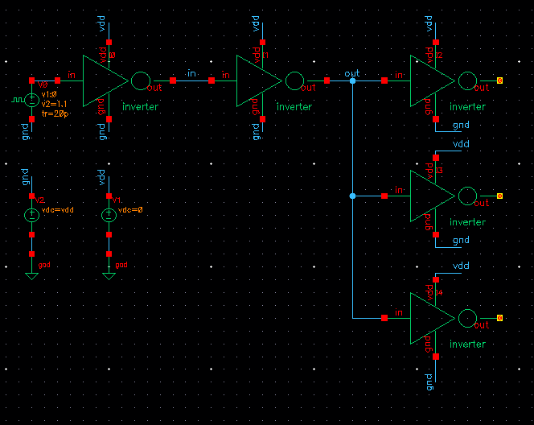
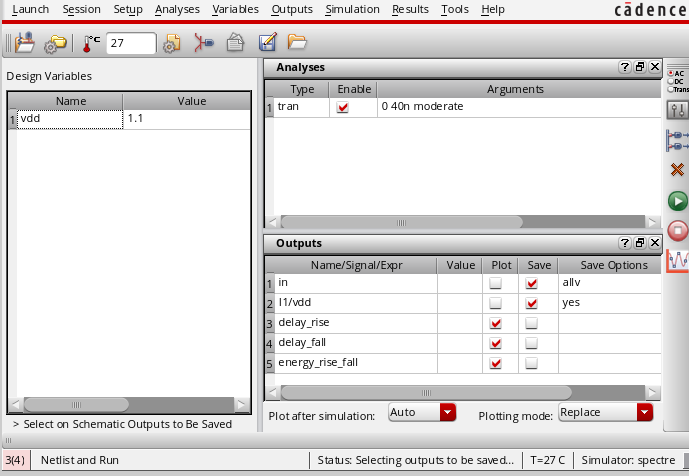

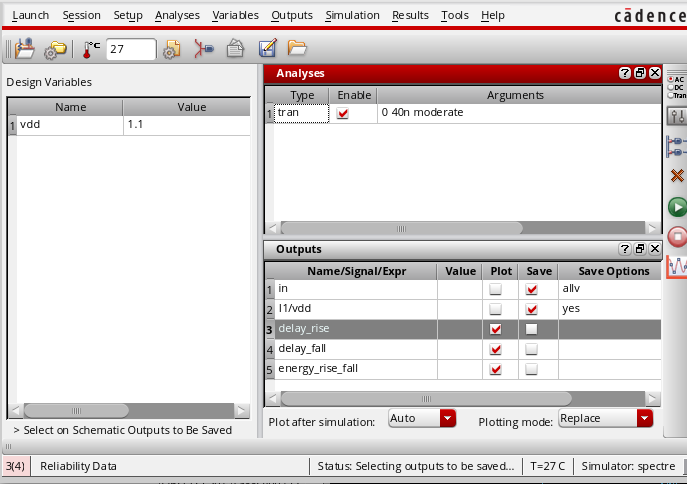

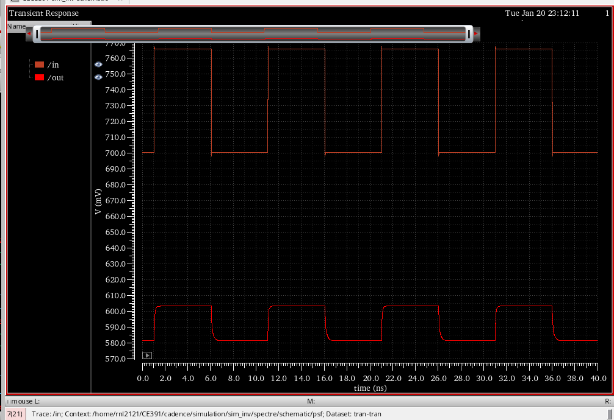
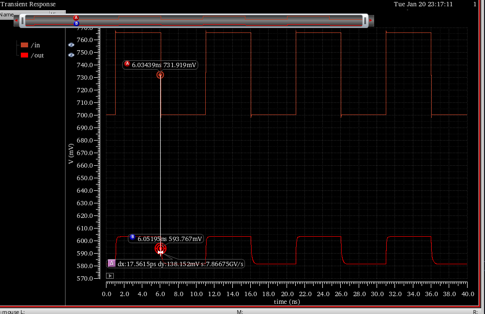
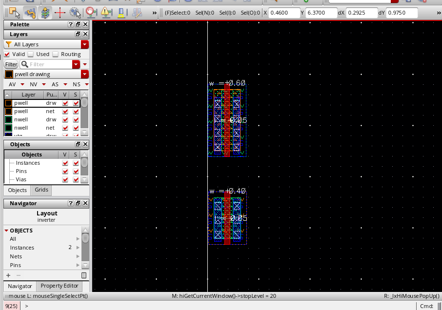

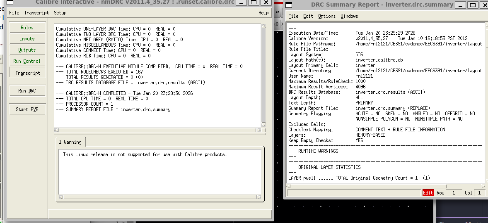

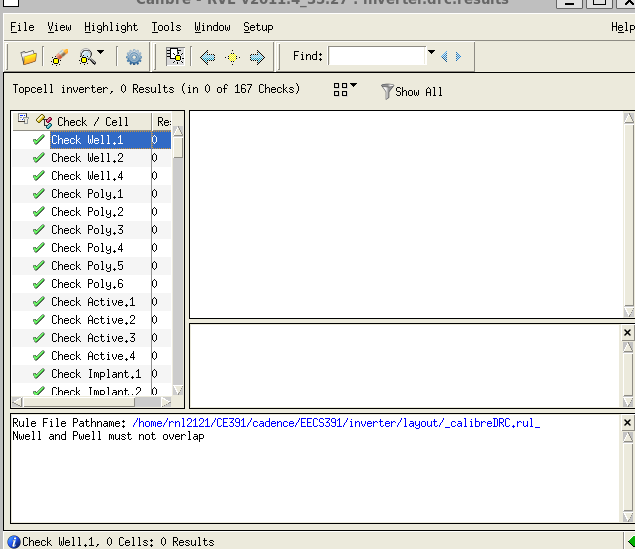

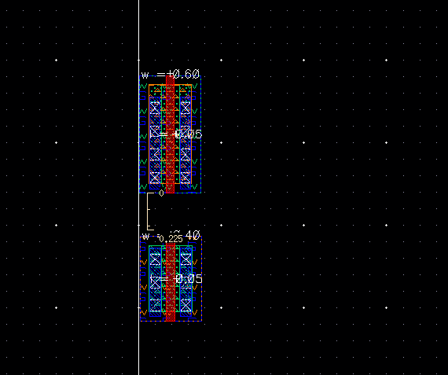

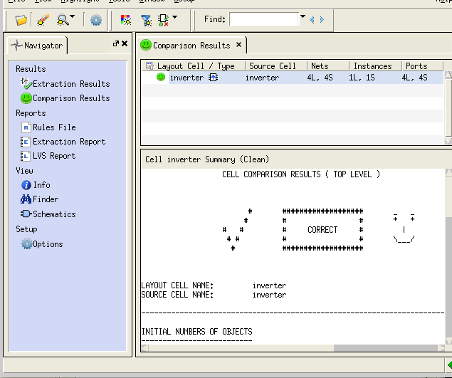

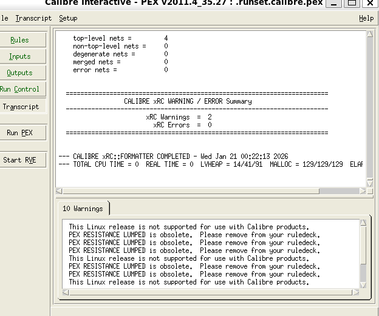

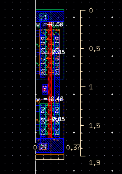
