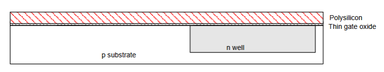

## Table of Contents

## Fabrication Steps

- Starts with blank wafer
  - wafer is lightly doped into P-type substrate (can form NMOS transistor)
- Builds inverter from bottom up
- First step is formation of n-well
  - Cover wafer with protective layer of glass
  - Remove layer where n-well should be built
  - Implant or diffuse n dopants (arsenic) into exposed wafer
  - Remove SiO_2

Lithography exposes the photoresist through n-well mask, and strip off the photoresist using solvant.
Then you etch the oxide with hydrofluoric acid (HF), which only attacks oxide where resist is exposed

## n-well

- n-well is formed with diffusion or ion implantation
- Diffusion
  - Places wafer in furnace with arsenic gas
  - Heat until the arsenic gas diffuses into the Si
- Ion Implantation
  - Blast wafer with beam of As ions
  - Ions blocked by SiO_2, only enter the exposed silicon

Then you strip off the oxide usign HF, which is back to bare wafer with n-well.

## Polysilicon

- less than 20 Angstroms (6-7 atomic layers)
- CVD of Silicon Layer
  - Place wafer in furnace with SiH_4
  - forms many small crystals called polysilicon
  - Heavily doped to be a good conductor
    

N-MOS - both source and drain are N, and P substrate in between.

# Middle Work, Didn't do yet...

## Short Channel Effect

- IN small transistors, theres a depletion region in sources and drains (shortens the channel)
  - This impacts the amount of charge required to invert the channel, and thus, makes V_t becomes a function of channel length
- In short channel effect: V_t decreases with smaller L, since leakage current increases, and transistor cannot be turned off...

Gates lose control of channel to due to source and drain, and V_t becomes smaller due to depletion
